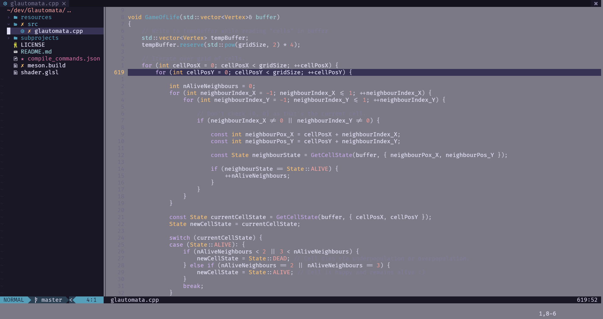

# Karsteski's Neovim Configuration

## Plugins

### General

- [packer.nvim](https://github.com/wbthomason/packer.nvim)                                  -- Neovim plugin manager
- [lualine.nvim](https://github.com/nvim-lualine/lualine.nvim)                              -- Neovim status line
- [nvim-web-devicons](https://github.com/kyazdani42/nvim-web-devicons)                      -- Icon provider
- [bufferline.nvim](https://github.com/akinsho/bufferline.nvim)                             -- A snazzy bufferline
- [nvim-tree.lua](https://github.com/kyazdani42/nvim-tree.lua)                              -- Neovim File Explorer
- [plenary.nvim](https://github.com/nvim-lua/plenary.nvim)                                  -- Neovim Lua functions library
- [toggleterm](https://github.com/akinsho/toggleterm.nvim)                                  -- Toggle Terminals
- [nvim-treesitter](https://github.com/nvim-treesitter/nvim-treesitter)                     -- Treesitter configurations and abstraction layer
- [telescope.nvim](https://github.com/nvim-telescope/telescope.nvim)                        -- Fuzzy finder
- [nvim-notify](https://github.com/rcarriga/nvim-notify)                                    -- Notification manager
- [gitsigns.nvim](https://github.com/lewis6991/gitsigns.nvim)                               -- Git decorations for Neovim
- [project.nvim](https://github.com/ahmedkhalf/project.nvim)                                -- Neovim project management
- [Godbolt.nvim](https://github.com/p00f/godbolt.nvim)                                      -- Display assembly for the current buffer or visual selection
- [Alpha.nvim](https://github.com/goolord/alpha-nvim)                                       -- Neovim Greeter
- [Neovim Session Manager](https://github.com/Shatur/neovim-session-manager)                -- Manage sessions in Neovim 
- [LuaSnip](https://github.com/L3MON4D3/LuaSnip)                                            -- Snippet Engine
- [friendly-snippets](https://github.com/rafamadriz/friendly-snippets)                      -- Snippets collection
- [nvim-autopairs](https://github.com/windwp/nvim-autopairs)                                -- Automatic pairing for brackets
- [Comment.nvim](https://github.com/numToStr/Comment.nvim)                                  -- Powerful commenting plugin
- [nvim-lastplace](https://github.com/ethanholz/nvim-lastplace)                             -- Return to last place in a file
- [bufdelete.nvim](https://github.com/famiu/bufdelete.nvim)                                 -- Delete a buffer without deleting a split
- [vim-godot](https://github.com/habamax/vim-godot)                                         -- Plugin that allows neovim integration with the Godot engine
- [nvim-navic](https://github.com/SmiteshP/nvim-navic)                                      -- Show curent code context
- [indent-blankline.nvim](https://github.com/lukas-reineke/indent-blankline.nvim)           -- Adds indentation guides to all lines
- [ChatGPT.nvim](https://github.com/jackMort/ChatGPT.nvim)                                  -- OpenAI ChatGPT

### LSP and Completion

- [mason.nvim](https://github.com/williamboman/mason.nvim)                                  -- External tooling manager
- [mason-lspconfig.nvim](https://github.com/williamboman/mason-lspconfig.nvim)              -- Bridges the mason.nvim-lspconfig gap 
- [mason-tool-installer.nvim](https://github.com/WhoIsSethDaniel/mason-tool-installer.nvim)
- [nvim-lspconfig](https://github.com/neovim/nvim-lspconfig)                                -- Built-in LSP configs
- [null-ls.nvim](https://github.com/jose-elias-alvarez/null-ls.nvim)                        -- LSP diagnostics, code actions and more
- [cmp-nvim-lsp](https://github.com/hrsh7th/cmp-nvim-lsp)                                   -- Completion source for Neovim's built-in LSP
- [nvim-cmp](https://github.com/hrsh7th/nvim-cmp)                                           -- Completion engine for Neovim
- [cmp-buffer](https://github.com/hrsh7th/cmp-buffer)                                       -- Buffer completion source
- [cmp-path](https://github.com/hrsh7th/cmp-path)                                           -- Filesystem path completion source
- [cmp-nvim-lua](https://github.com/hrsh7th/cmp-nvim-lua)                                   -- Neovim Lua API completion source
- [cmp_luasnip](https://github.com/hrsh7th/cmp_luasnip)                                     -- Luasnip completion source 

### Debugging

- [nvim-dap](https://github.com/mfussenegger/nvim-dap)                                      -- Debug Adapter Protocol client implementation
- [nvim-dap-ui](https://github.com/rcarriga/nvim-dap-ui)                                    -- UI for nvim-dap
- [telescope-dap.nvim](https://github.com/nvim-telescope/telescope-dap.nvim)                -- nvim-dap Telescope extension
- [nvim-dap-virtual-text](https://github.com/theHamsta/nvim-dap-virtual-text)               -- Virtual text support for nvim-dap
- [persistent-breakpoints.nvim](https://github.com/Weissle/persistent-breakpoints.nvim)     -- Saving of nvim-dap's breakpoints 

### Colour schemes

- [nightfox.nvim](https://github.com/edeneast/nightfox.nvim)
